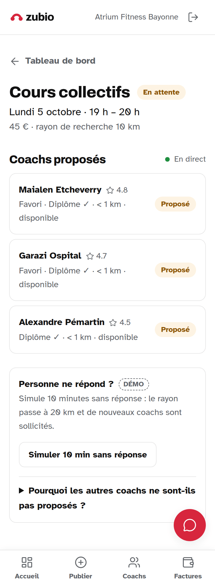
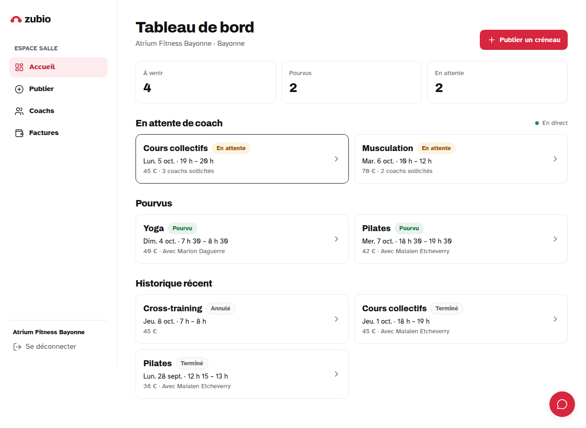

# Zubio

**Le bon coach, au bon créneau.** Prototype de démonstration qui relie les salles de sport de Bayonne, Anglet et Biarritz aux coachs disponibles.

Une salle publie un créneau → Zubio propose les coachs compatibles (discipline, diplôme vérifié, distance, disponibilité, tarif) → un coach accepte en un geste → la mission est confirmée des deux côtés, en direct.

| Mobile | Ordinateur |
|---|---|
|  |  |

Toutes les captures (375 px et 1280 px) sont dans [`docs/screenshots/`](docs/screenshots).

## Ce que contient la démo

- **Espace salle** : tableau de bord, publication d'un créneau en moins de 30 secondes, coachs proposés avec la raison du match et mise à jour en direct, catalogue filtrable avec favoris, simulation « 10 min sans réponse », facture d'exemple imprimable.
- **Espace coach** : offres reçues (accepter / refuser), missions à venir et revenus du mois, disponibilités hebdomadaires, profil et diplômes.
- **Espace admin** : chiffres clés, salles, coachs, validation des diplômes, et sélecteur **Sport / Immobilier** qui montre le même cœur appliqué à un autre métier.
- **Assistant support** : questions fréquentes et « Où en est mon créneau ? » ; réponses par l'API Mistral si une clé est fournie.
- **PWA** : installable sur l'écran d'accueil.

Le scénario de présentation est dans [DEMO.md](DEMO.md), le déploiement dans [DEPLOY.md](DEPLOY.md), les choix techniques dans [DECISIONS.md](DECISIONS.md).

## Lancer en local

Prérequis : Node.js 20.9 ou plus récent, et Docker (pour la base Supabase locale).

```bash
npm install
npx supabase start          # base PostgreSQL, Auth et Realtime en local
npx supabase db reset       # applique les migrations et les données de démo
cp .env.example .env.local  # puis collez la clé « anon » affichée par `npx supabase status`
npm run dev
```

Ouvrez http://localhost:3000/demo et entrez comme salle, coach ou admin.

Sans Docker, vous pouvez aussi brancher l'application sur un projet Supabase hébergé (voir [DEPLOY.md](DEPLOY.md), étapes 2 et 3) et renseigner son URL et sa clé dans `.env.local`.

### Commandes utiles

| Commande | Rôle |
|---|---|
| `npm run dev` | Serveur de développement |
| `npm run lint` · `npm run typecheck` · `npm run build` | Vérifications lancées aussi par la CI GitHub Actions |
| `npm run seed:generate` | Régénère `supabase/seed.sql` (15 salles, 40 coachs, 22 créneaux, verticale immobilier) |
| `npm run db:types` | Régénère les types TypeScript de la base locale |
| `npm run icons:generate` | Régénère favicon et icônes PWA à partir du symbole |
| `npm run screenshots` | Captures 375 / 1280 px dans `docs/screenshots` (application lancée) |

## Organisation du code

```
src/
  core/             logique générique : créneaux, matching, disponibilités, distances (aucun vocabulaire métier)
  verticals/        sport (disciplines, diplômes, libellés) et immobilier (corps de métier, justificatifs)
  config/brand.ts   nom, slogan, couleurs, logo, commission : tout changer à un seul endroit
  app/              pages : /demo, /salle, /coach, /admin, /api/support
  components/ui/    design system (boutons, cartes, badges, champs…)
  lib/              Supabase, garde de rôle, accès aux données, assistant
supabase/
  migrations/       schéma, RLS sur toutes les tables, fonctions transactionnelles, Realtime
  seed.sql          données de démo (généré par scripts/generate-seed.mjs)
public/brand/       logo (complet, symbole, blanc sur rouge, noir)
```

Le matching (`src/core/matching.ts`) est une fonction pure à règles simples : filtres éliminatoires (compétence, justificatif valide, distance, disponibilité, tarif), puis classement (favori, note, distance), et une raison lisible pour chaque proposition, par exemple « Favori · Diplôme ✓ · 4 km · disponible ».

## Sécurité

- RLS activée sur toutes les tables : un coach ne voit que ses données, une salle que les siennes, l'admin voit tout.
- Rôles stockés en base et vérifiés côté serveur sur chaque page et chaque action protégées.
- L'acceptation d'une offre est une fonction SQL atomique qui impose l'identité de la session ; la clé `service_role` n'est pas utilisée par l'application.
- Tous les secrets passent par des variables d'environnement (`.env.example`) ; `.env*` est ignoré par Git.

Données fictives. Prototype de démonstration, sans paiement réel.
